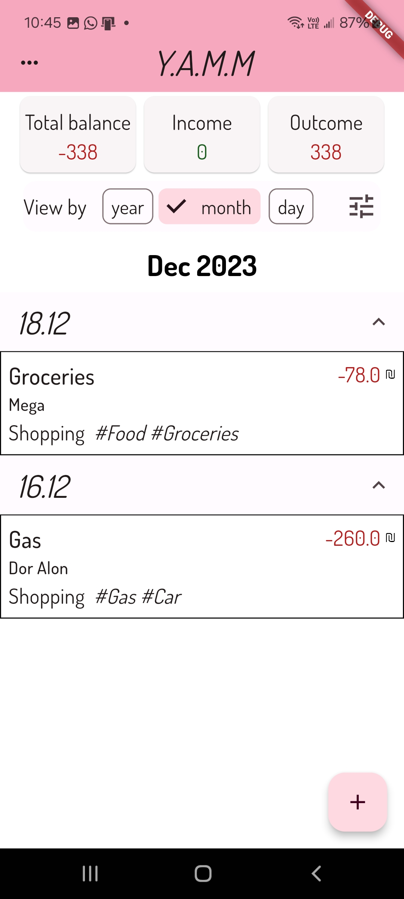
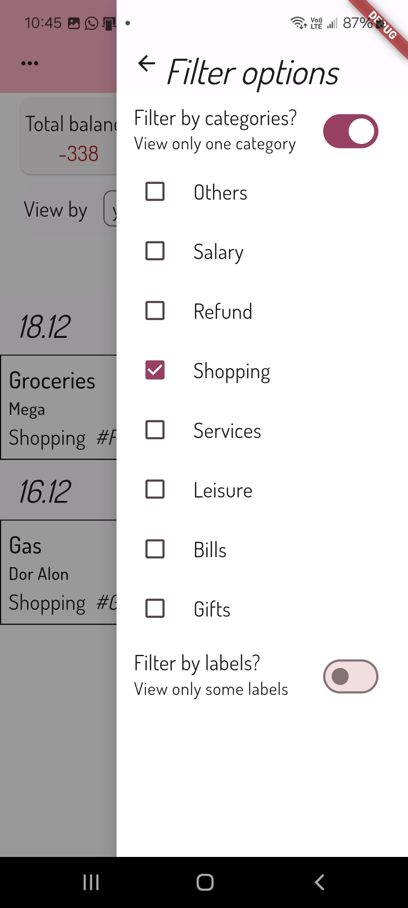
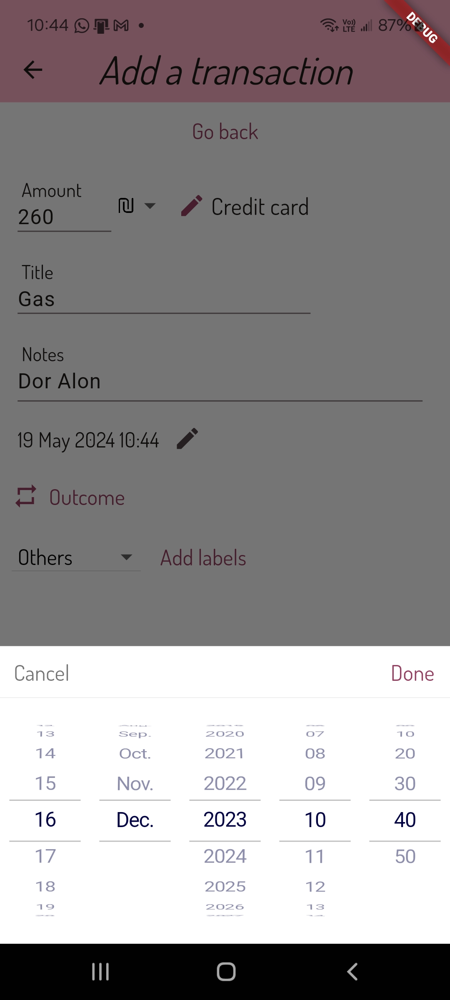
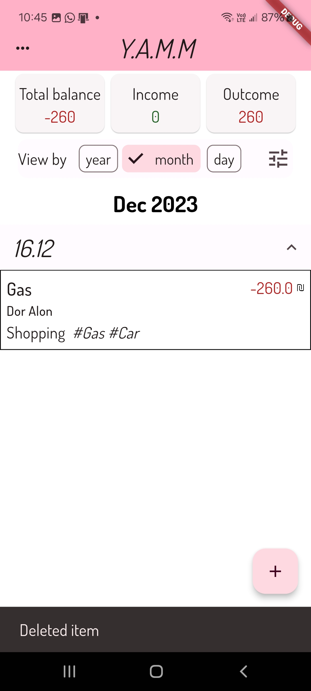

# Expense-tracker
An application for expense tracking.

Add incomes and outcomes, filter by categories for easy money management experience.

by Shira Troyansky

## Preview

## Features
1. Filter transactions by date
2. Filter transactions by categories
3. Filter transactions by labels (sub categories)
4. Export transactions file
5. Add new labels
6. Delete transactions

## Whats cooking..
1. Show payment method
2. Import transactions
3. edit transactions
